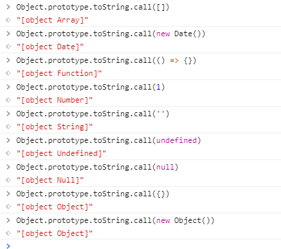

在学习vue源码时看到两个检查对象的函数

```javascript
/**
 * Quick object check - this is primarily used to tell
 * Objects from primitive values when we know the value
 * is a JSON-compliant type.
 */
function isObject (obj) {
  return obj !== null && typeof obj === 'object'
}

/**
 * Strict object type check. Only returns true
 * for plain JavaScript objects.
 */
function isPlainObject (obj) {
  return Object.prototype.toString.call(obj) === '[object Object]'
}
```

## isObject

isObject主要用来区分对象和原始数据类型，typeof是一个一元操作符，返回操作数类型，返回值有

| x             | typeof x    |
| ------------- | ----------- |
| undefined     | "undefined" |
| null          | "object"    |
| true or false | "boolean"   |
| 数值或NaN     | "number"    |
| BigInt        | "bignit"    |
| 字符串        | "string"    |
| 符号          | "symbol"    |
| 函数          | "function"  |
| 非函数对象    | "object"    |

其中null和非函数对象都是返回object，如果区分两者，需要显式判断，对所有的除函数之外的所有对象和数组，typeof都返回object，只能用typeof用来区分对象和其他原始类型，无法区分不同对象的类，isObject函数，如果是非函数和null以外的所有对象和数组都返回true

## isPlainObject

JavaScript函数也是对象，有自己的方法，其中函数对象的两个方法call和apply，可以用来间接调用函数，并允许指定this值，表示**可以将任意函数作为任意对象的方法来调用**，即使该对象并没有这个方法，call的参数作为函数的参数，apply期待数组参数。

isPlainObject是严格的类型检查，只有纯粹的对象返回true，纯粹的对象指，通过**自定义class和自定义构造函数、{}字面量、new Object()、Object.create()创建的对象返回true，通过JavaScript内置的标准类和构造函数创建的对象返回false**，例如new Date、new Array、Array.from、[]等等，像Array，Date，String等内置构造函数，重写了toString方法，这里使用Object.prototype.toString，最低层原型链的toString方法



